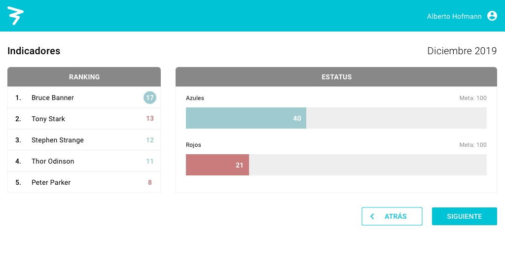

# Prueba Práctica de Desarrollo UI
*3IT ~ Quality of Service*

## ¿Qué debes hacer? 🚀
Construir vista en el único componente que posee el proyecto, teniendo como referencia la imagen a continuación.

## Guía 📋
Para empezar, realiza un fork del proyecto, después, haz un commit con el comentario "Inicio prueba UI 3it".

* Teniendo el repositorio local, ubica la raíz
* Instala las librerías de Angular `npm install`
* Levanta el proyecto `ng serve` y visualiza en `http://localhost:4200`
* Al terminar la prueba, publica tus cambios
* Comparte tu repositorio con nosotros por correo electrónico.

## Recursos 📦
* Iconografía:
[Material icons](https://material.io/resources/icons/?style=baseline) 
* Tipografía: [Roboto](https://fonts.google.com/specimen/Roboto)
* Colores: `$color1, $color2, $color3, $color4, $color5` en `styles.scss`
* Datos dummy: `dataDummy` en `app/app.component.ts`

## ¿Qué evaluaremos? 🚧 
1. Las buenas prácticas
2. La apariencia del producto final
3. El uso de los datos dummy
4. El tiempo que demora la entrega

##

### *Run Forrest! Run!* ⚡️
